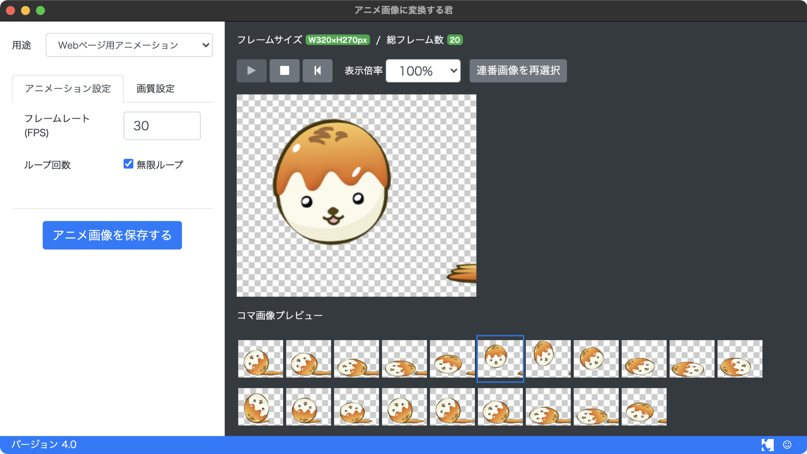
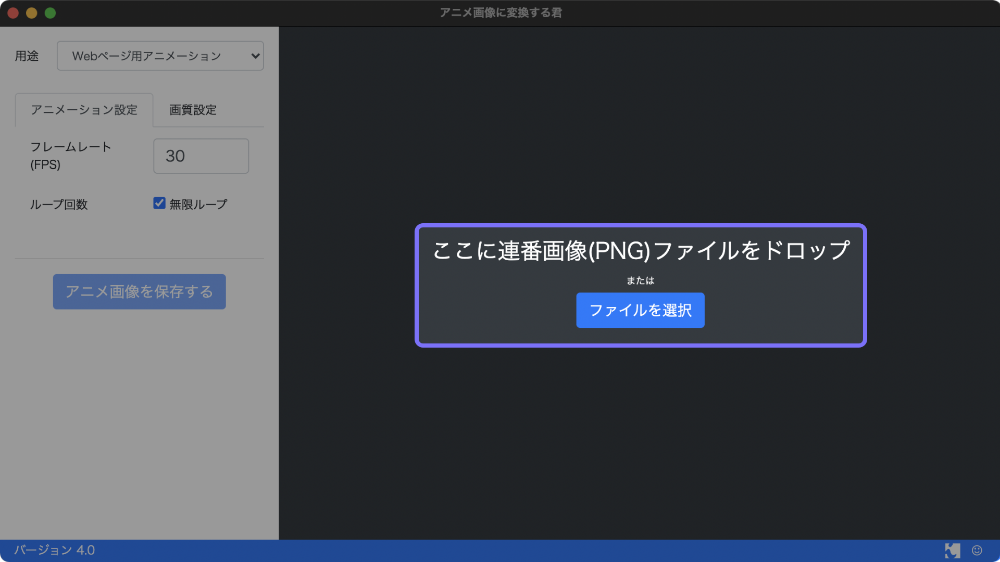
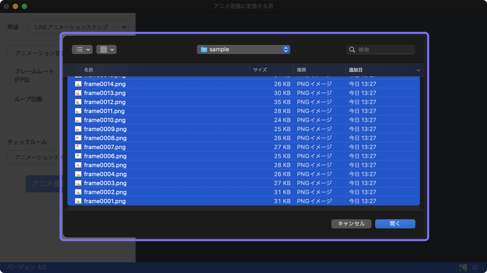
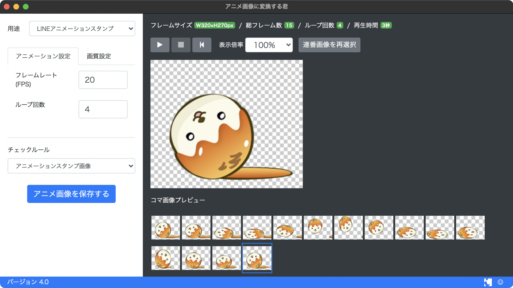
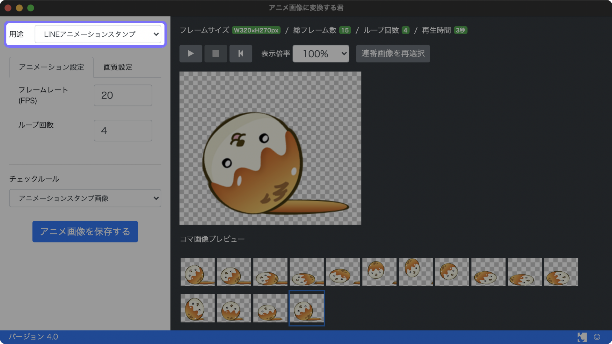
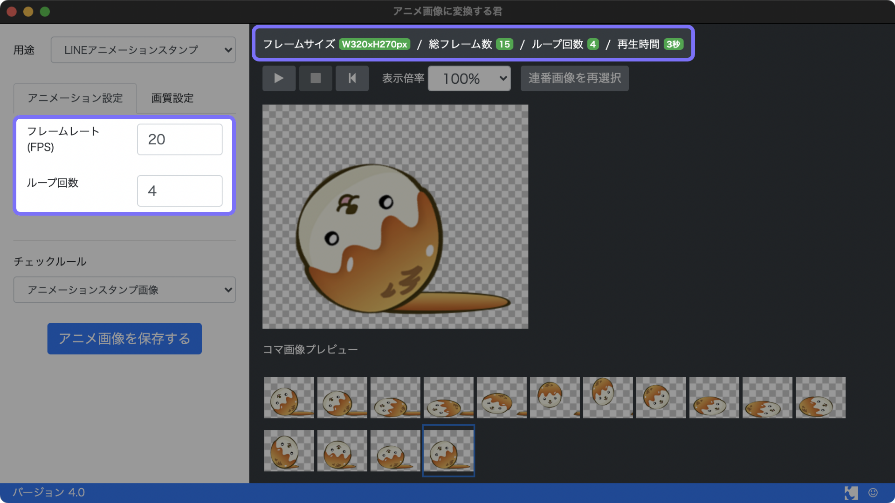
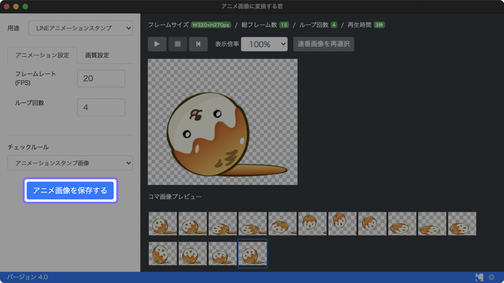
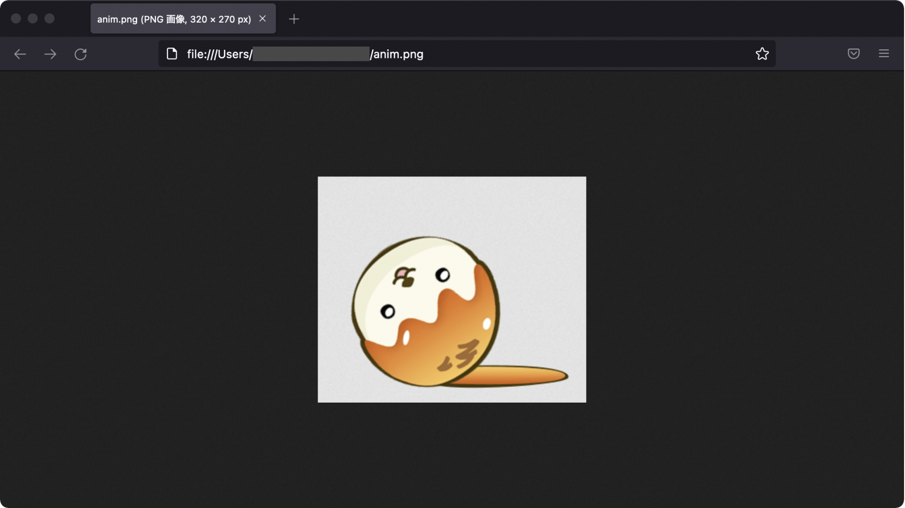

# アニメ画像に変換する君

このソフトは連番画像をLINEアニメーションスタンプや、Web用アニメーション画像に変換するソフトウェアです。WindowsとOS Xに対応し、無償で提供しています。

## このソフトウェアでできること

- **LINEアニメーションスタンプの作成**
  - APNGファイルの作成
  - **LINEアニメーションスタンプのルール適合チェック**
- 各種パラメーター設定
  - ループ設定
  - **APNGの容量を小さくするオプション**(少しだけ画質が劣化しますが、容量はかなり小さくなります)
- Webページ用アニメ画像の作成
  - Firefox, Safari用のAPNGファイル作成
  - Chrome用のWebPファイル作成
  - それらの画像を表示するためのHTMLファイルの作成

## インストール方法

次のURLからソフトウェアをダウンロードください。

- [Windowsはこちらから](https://github.com/ics-creative/160609_animation-image-generator/blob/master/help/Help_Windows.md)
- [Windows 10以降はこちらから(Windows Store)](https://www.microsoft.com/ja-jp/p/%E3%82%A2%E3%83%8B%E3%83%A1%E7%94%BB%E5%83%8F%E3%81%AB%E5%A4%89%E6%8F%9B%E3%81%99%E3%82%8B%E5%90%9B/9n36kvc52st9?activetab)
- [macOSはこちらから(Mac App Store)](https://itunes.apple.com/jp/app/anime-hua-xiangni-bian-huansuru/id1127676902?mt=12)

## 使い方

### ①素材の作成

PNGの連番画像(画像シーケンス)を用意ください。PNGの連番画像の作成方法は次の記事「[LINEのアニメーションスタンプはこう作る！ APNGファイルの作り方を徹底解説 - ICS MEDIA](https://ics.media/entry/12268/2)」を参考にするといいでしょう。

連番画像とは、ファイル名に数字が振られていることが重要です。例として、次の図板のように`frame0001.png`〜`frame0015.png`という名前にします。

### ②連番画像の読み込み

「アニメ画像に変換する君」を起動し、[ファイルを選択]ボタンを選択します。

ファイルダイアログでは、ファイルを[Shift]キーを押しながら複数枚選択し、[開く]をクリックします。

すると、「アニメ画像に変換する君」の画面内に複数の画像が読み込まれ、自動的にアニメーションが再生されます。

### ③用途を選択

「アニメ画像に変換する君」の[用途]を「LINEアニメーションスタンプ」を選択します。

[フレームレート]と[ループ回数]を設定しましょう。

### ④アニメ画像を保存

[アニメ画像を保存する]ボタンをクリックして、ファイルの保存先を選択します。

### ⑤PNGファイルの確認

LINEアニメーションスタンプのAPNGファイルは拡張子は`.png`です。ブラウザFirefoxで出力したAPNGファイルを開き、アニメーションを確認しましょう。

### ⑥LINEアニメーションスタンプのルールのチェック

LINEスタンプアニメーションの[ガイドライン](https://creator.line.me/ja/guideline/animationsticker/detail/)がには難しいルールが掲載されてます。このソフトウェアではルールに適合しているかチェックする機能があります。ファイルの保存後に、ルールに適合してない点があったらアラートで教えてくれます。

全部のルールをチェックしているわけではないのですが、少し安心してファイル保存できるようになると思います。

#### チェックしているルール

- フレームサイズ
- コマ数
- 再生時間
- ファイル容量

※ LINEスタンプアニメーションのガイドラインと「ルールが違うんじゃない？」という箇所があれば、指摘＆要望くださいませ。

## 生成物のライセンスについて

このアプリケーションを利用して作成したAPNGファイルやWebPファイルは個人・商用利用ともに無償でお使いいただけます。著作権はそれらを制作した方に帰属します。

## 開発者について

[株式会社ICS](https://ics.media/)というWeb制作プロダクションが開発してます。

### 不具合報告や機能要望について

ソフトウェアが使いやすくなるよう改善していきたいと考えています。もし不具合がありましたらお気軽に次のリンクからお寄せください。また、機能要望もお待ちしております！

http://goo.gl/forms/5DUI1UnTUXR6AmCw2

## ソフトウェアについて

無償でオープンソースとなっています。個人・商用利用ともにご自由にお使いください。アプリケーションのコードは本リポジトリで公開してます。

### 使用条件＆免責事項

- 本ソフトウェアをダウンロードし、インストールすることによって生じる問題について、その責を負えませんのでご了承ください。
- 本ソフトウェアの全てまたは一部を複製・再配布することを禁じます。
